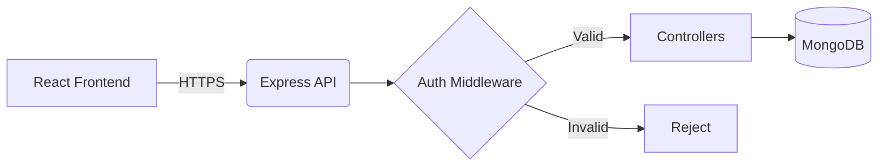
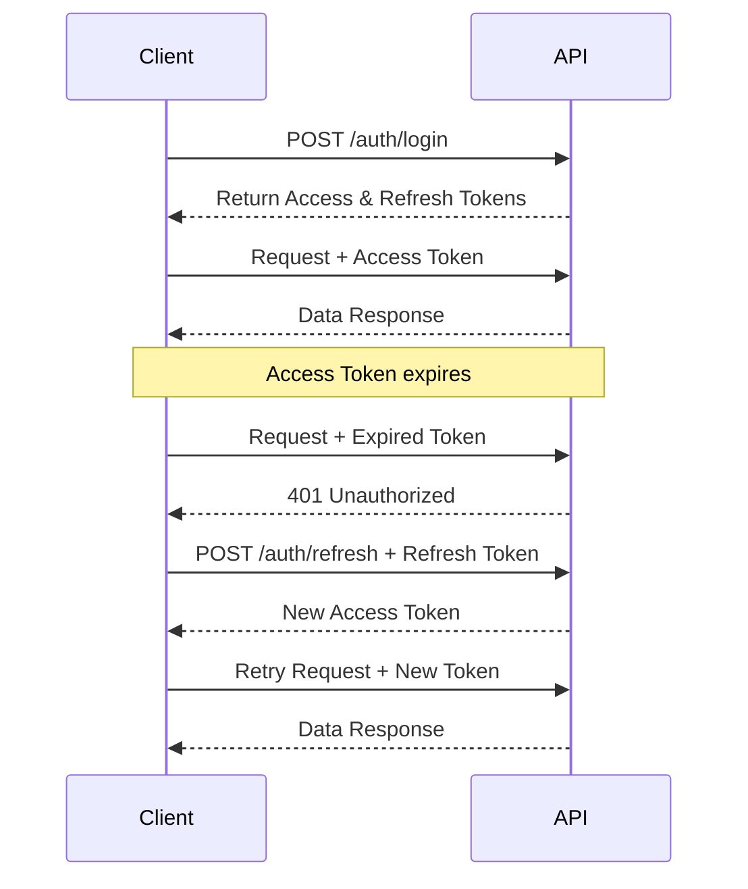
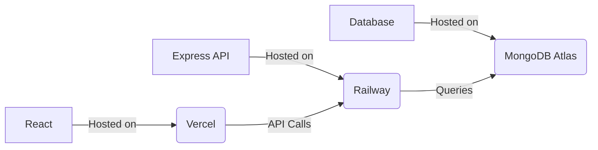

# Architecture & Deployment Summary

**Parth Singhal**  
Role: MERN Stack Internship Assignment  
Date: 28 July 2026  

---

## 1. Project Overview

The primary objective of this application is to demonstrate a production-ready authentication system leveraging the MERN (MongoDB, Express, React, Node.js) stack. The project showcases secure token-based authentication mechanisms utilizing both JSON Web Tokens (JWT) for short-lived access and refresh tokens for persistent sessions.

This implementation focuses on bridging modern client-side architectures with robust RESTful APIs, emphasizing secure data transmission, robust session management, and adherence to production deployment best practices. By separating concerns across distinct layers, the application maintains high maintainability, ensuring that authentication, data modeling, and business logic remain isolated yet tightly integrated.

---

## 2. System Architecture

The application adopts a standard three-tier architecture model, separating the presentation layer, application logic, and data storage to ensure modularity and scalability.

- **Frontend (React)**: Handles user interactions, state management, routing, and HTTP request coordination. It is responsible for rendering the UI and securely managing client-side token storage.
- **REST API (Express/Node.js)**: Acts as the intermediary, exposing endpoints for user registration, authentication, and resource retrieval.
- **Authentication Layer**: A middleware component intercepting incoming requests to validate JWT access tokens, extract user identity, and authorize access to protected routes.
- **Database (MongoDB)**: Persists user records, hashed credentials, and handles data integrity.

---

## 3. Application Structure

The project structure enforces strict separation of concerns, ensuring that distinct functionalities are encapsulated within dedicated directories.

### Frontend
- **Pages**: Top-level route components representing complete views (e.g., Login, Dashboard).
- **Components**: Reusable, presentation-focused UI elements.
- **Context**: Global state management providers for handling authentication state across the application.
- **Services**: Abstracted HTTP client configurations and API request definitions.
- **Hooks**: Custom React hooks encapsulating reusable component logic and state behaviors.

### Backend
- **Controllers**: Functions handling incoming HTTP requests, orchestrating business logic, and returning responses.
- **Routes**: URL endpoint definitions mapped to specific controller actions.
- **Middleware**: Intercepting functions for request processing, authentication validation, and error handling.
- **Services**: Encapsulated core business logic, database queries, and external integrations.
- **Models**: Mongoose schemas defining MongoDB document structures and validation rules.
- **Utils**: Helper functions, cryptographic utilities, and shared constants.

This separation ensures that each module has a single responsibility, facilitating easier testing, debugging, and future feature integration.

---

## 4. Authentication Flow

The authentication lifecycle utilizes a dual-token strategy to balance security and user experience. 

Upon successful authentication, the server issues a short-lived Access Token and a long-lived Refresh Token. The client utilizes the Access Token for subsequent API requests. When the Access Token expires, an Axios interceptor automatically catches the 401 response, utilizes the Refresh Token to request a new Access Token from the `/auth/refresh` endpoint, and transparently retries the original request.

---

## 5. Token Storage & Exchange

Tokens are managed to mitigate the risks of Cross-Site Scripting (XSS) and Cross-Site Request Forgery (CSRF).

- **Access Token**: Short-lived JWT used to authorize API requests. It contains the user's identity and minimal claims. Due to its short lifespan, it minimizes the window of opportunity if intercepted.
- **Refresh Token**: Long-lived token used exclusively to obtain new access tokens. 

**Refresh Token Rotation**: Whenever a refresh token is used to generate a new access token, a new refresh token is also issued, and the old one is invalidated. This limits the lifespan of a stolen refresh token and provides early detection of token compromise.

| Feature | Access Token | Refresh Token |
|---------|--------------|---------------|
| **Purpose** | Authorize API access | Obtain new Access Tokens |
| **Lifetime** | Short (e.g., 15 minutes) | Long (e.g., 7 days) |
| **Storage** | Application Memory | HttpOnly, Secure Cookie |
| **Transmission** | Authorization Header (Bearer) | Cookie / Request Body |

Short-lived access tokens reduce the risk of token theft, while refresh tokens improve the user experience by maintaining persistent sessions without requiring frequent manual logins.

---

## 6. Security Decisions

The application implements defense-in-depth strategies:

- **Password Hashing (bcrypt)**: Passwords are one-way hashed with a computationally expensive salt, preventing rainbow table attacks and credential exposure during database breaches.
- **JWT (JSON Web Tokens)**: Stateless authentication mechanism ensuring request integrity via cryptographic signatures.
- **Refresh Token Rotation**: Minimizes the impact of compromised long-lived tokens.
- **Protected Routes**: Restricts unauthorized access at both the client routing level and server API level.
- **Input Validation**: Sanitizes and validates incoming request payloads to prevent injection attacks and ensure data consistency.
- **Environment Variables**: Isolates sensitive configuration (secrets, URIs) from the codebase.
- **Helmet**: Secures Express applications by setting various HTTP headers to mitigate common web vulnerabilities.
- **Rate Limiting**: Throttles incoming requests from identical IP addresses to prevent brute-force attacks and denial-of-service.
- **Secure Cookies**: Ensures tokens stored in cookies cannot be accessed via client-side scripts (HttpOnly) and are only transmitted over HTTPS (Secure).
- **CORS**: Restricts cross-origin requests to trusted domains, preventing unauthorized external applications from consuming the API.
- **Centralized Error Handling**: Prevents the leakage of stack traces and sensitive system implementation details in production environments.

---

## 7. State Management

The frontend relies on lightweight and robust state management solutions:

- **Context API**: Manages global authentication state, providing user data and session status across the component tree without prop drilling. It was chosen over Redux because the state requirements for authentication are relatively localized and do not necessitate the boilerplate of a Flux architecture.
- **Axios Instance**: A pre-configured HTTP client enforcing base URLs, default headers, and timeout behaviors.
- **Axios Interceptors**: Intercepts requests and responses to automatically inject access tokens and silently handle the token refresh flow on 401 responses.
- **Automatic Token Refresh**: Provides a seamless user experience by renewing sessions without prompting the user.
- **Protected Routes**: Wrapper components that dynamically render routes based on the current authentication context.
- **Loading State**: Prevents premature redirects by resolving the initial authentication check before mounting the application view.

---

## 8. Deployment Architecture

The application is deployed across specialized cloud platforms optimized for specific workloads.

- **Vercel**: Chosen for the frontend due to its exceptional Edge network, automated CI/CD pipelines from GitHub, and optimized build processes tailored for React applications.
- **Railway**: Hosts the backend API. Selected for its straightforward Node.js deployment, robust environment variable management, and continuous deployment capabilities directly from the repository.
- **MongoDB Atlas**: Serves as the managed cloud database, offering high availability, automated backups, and a highly reliable free tier suitable for development and production environments.

---

## 9. Environment Variables

Sensitive configurations are managed via environment variables.

| Variable | Purpose |
|----------|---------|
| `PORT` | Defines the listening port for the Express server. |
| `MONGO_URI` | Connection string for MongoDB Atlas. |
| `JWT_ACCESS_SECRET` | Cryptographic key for signing Access Tokens. |
| `JWT_REFRESH_SECRET` | Cryptographic key for signing Refresh Tokens. |
| `ACCESS_TOKEN_EXPIRY` | Duration until the Access Token becomes invalid. |
| `REFRESH_TOKEN_EXPIRY` | Duration until the Refresh Token becomes invalid. |
| `NODE_ENV` | Indicates the runtime environment (development/production). |
| `VITE_API_URL` | Base URL of the backend API for the frontend client. |

---

## 10. Design Decisions

- **Why JWT?**: Enables stateless server architecture, reducing database lookups for session validation and facilitating horizontal scaling.
- **Why Refresh Tokens?**: Mitigates the security risks of long-lived access tokens while preserving a frictionless user experience.
- **Why Axios Interceptors?**: Centralizes token management and API retry logic, removing the need to manually handle token expiration in every component.
- **Why Context API?**: Provides a native, lightweight solution for dependency injection and state sharing without the external dependencies of Redux.
- **Why bcrypt?**: Industry standard for password hashing, intentionally slow to deter brute-force and dictionary attacks.
- **Why MongoDB?**: Document-oriented schema provides flexibility, aligning well with JSON data structures common in JavaScript applications.
- **Why React?**: Component-based architecture facilitates code reuse, efficient DOM updates via the Virtual DOM, and a robust ecosystem.
- **Why Express?**: Minimalist and unopinionated framework providing the necessary routing and middleware capabilities for building efficient REST APIs in Node.js.

---

## 11. Scalability

The current architecture establishes a foundation that can be extended to support enterprise requirements:

- **Email Verification & Password Reset**: Integrating transactional email services for account recovery and identity verification.
- **Redis Token Store**: Moving refresh token validation and blacklisting to an in-memory data store like Redis to reduce MongoDB load and improve response times.
- **OAuth Integration**: Supporting federated identity providers (Google, GitHub) for frictionless onboarding.
- **Role-Based Access Control (RBAC)**: Expanding the JWT claims and middleware to support granular permissions and user roles.
- **Audit Logs**: Implementing an event sourcing pattern to track sensitive actions for compliance and security monitoring.
- **Microservices**: Decoupling the authentication domain into an independent microservice to allow independent scaling and deployment.
- **Horizontal Scaling**: Leveraging clustering and load balancers to distribute API traffic across multiple Node.js instances.

---

## 12. Conclusion

This application implements robust, production-oriented authentication practices within a modern MERN stack architecture. By enforcing strict separation of concerns, employing stateless JWT strategies, and utilizing robust cloud infrastructure, the project ensures a secure, scalable, and highly maintainable codebase well-suited for future enterprise enhancements.
