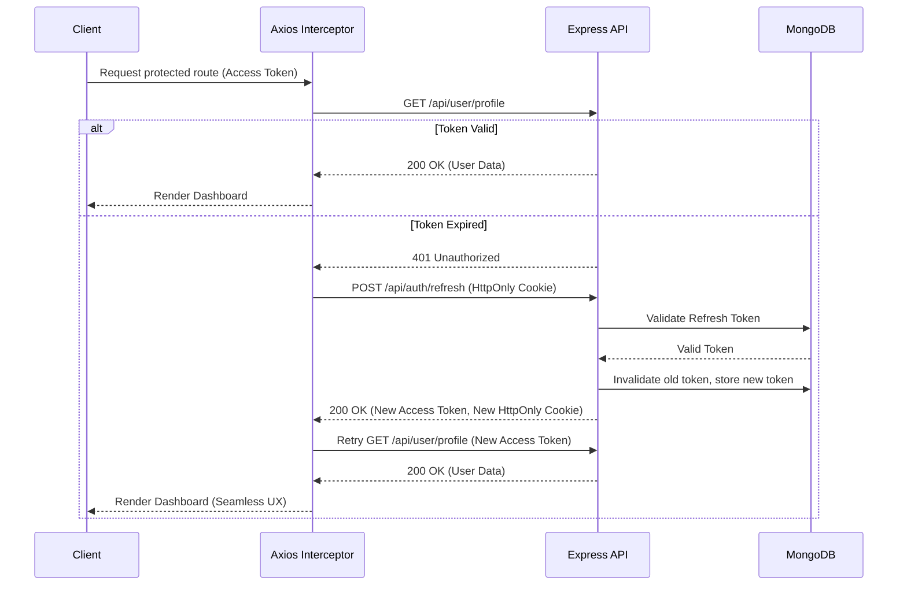

# MERN Authentication Architecture

[](https://reactjs.org/)
[](https://nodejs.org/)
[](https://expressjs.com/)
[](https://www.mongodb.com/)
[](https://tailwindcss.com/)
[](https://opensource.org/licenses/MIT)

A production-grade authentication implementation demonstrating secure, scalable engineering practices using the MERN stack.

## Table of Contents

- [Architecture Diagram](#architecture-diagram)
- [Assignment Deliverables](#assignment-deliverables)
- [Features](#features)
  - [Frontend Features](#frontend-features)
  - [Backend Features](#backend-features)
- [Security Measures](#security-measures)
- [Screenshots](#screenshots)
- [Design Decisions](#design-decisions)
- [Challenges Faced](#challenges-faced)
- [Environment Variables](#environment-variables)
- [Installation](#installation)
- [Deployment](#deployment)
- [Future Improvements](#future-improvements)
- [AI Usage Disclosure](#ai-usage-disclosure)
- [License](#license)

---

## Architecture Diagram



---

## Assignment Deliverables

- **GitHub Repository:** `https://github.com/PLYRparth/twoTokenAuthentication`
- **Live Frontend:** `https://two-token-authentication.vercel.app`
- **Live Backend:** `https://twotokenauthentication.up.railway.app`

- **Architecture Summary:** MERN stack utilizing two-token JWT architecture with strict refresh token rotation and Axios interceptors.
- **Deployment Summary:** Frontend hosted on Vercel, API managed via Railway, Database hosted on MongoDB Atlas.
- **AI Platform Used:** Google Deepmind / Gemini.

---

## Features

### Frontend Features
- **Protected Routes:** Validates authentication state at the router level, preventing unauthorized access to restricted views.
- **Context API:** Centralized authentication state management serving as a single source of truth without the boilerplate of Redux.
- **Axios Interceptors:** Global request/response middleware ensuring access tokens are uniformly attached and 401 errors are intercepted.
- **Automatic Token Refresh:** Seamless, background token rotation that preserves user context during active sessions.
- **Responsive Design:** Fluid layouts ensuring usability across desktop, tablet, and mobile environments.
- **Modern UI:** Minimalistic dark theme utilizing Tailwind CSS, featuring subtle transitions and skeleton loaders.

### Backend Features
- **Controllers:** Isolated business logic ensuring routes remain strictly declarative.
- **Services:** Decoupled utility logic handling token generation and cryptographic operations.
- **Middleware:** Robust request interception handling authorization validation, rate limiting, and global error boundaries.
- **Authentication:** Dual-token issuance ensuring robust identity verification.
- **Validation:** Strict payload schemas rejecting malformed requests prior to controller execution.
- **MongoDB:** Mongoose schemas leveraging pre-save hooks for password hashing and ensuring data integrity.

---

## Security Measures

| Measure | Implementation Detail |
|---------|------------------------|
| **Password Hashing** | Applied `bcryptjs` with a cost factor of 10 within the Mongoose pre-save hook. |
| **JWT Authentication** | Stateless, signed payloads utilizing strong cryptographic secrets. |
| **HTTP-only Cookies** | Refresh tokens are transmitted exclusively via `HttpOnly` and `SameSite=strict` cookies, mitigating XSS. |
| **Refresh Token Rotation** | Every refresh request issues a new refresh token and invalidates the previous one in the database, preventing replay attacks. |
| **Helmet** | Modifies HTTP headers to defend against well-known web vulnerabilities (e.g., Clickjacking, MIME sniffing). |
| **Rate Limiting** | `express-rate-limit` is configured on authentication endpoints to prevent brute-force and credential stuffing attacks. |
| **Environment Variables** | Cryptographic secrets and connection strings remain strictly off-source, loaded via `dotenv`. |
| **Protected Routes** | Server-side middleware (`protect`) enforces access token validation before permitting execution of restricted controllers. |
| **Input Validation** | Defensive programming via Zod (frontend) and strict schema checks (backend) neutralizing injection vectors. |
| **Error Handling** | A centralized error middleware intercepts unhandled promise rejections, ensuring stack traces do not leak in production. |
| **CORS Configuration** | Whitelisted origins with explicit credential allowance, rejecting cross-origin attacks. |
| **Refresh Token Secrecy** | Refresh tokens are never exposed to the JavaScript runtime context on the client. |

---

## Design Decisions

- **Why JWT?**
  Stateless tokens eliminate the need for persistent server-side sessions, drastically reducing database read operations and inherently supporting horizontal scaling.
- **Why separate Access & Refresh Tokens?**
  A brief access token validity period (15 minutes) limits exposure if intercepted. The refresh token allows extended sessions but remains heavily secured and rotatable.
- **Why Axios Interceptors?**
  Interceptors centralize token management logic. By catching 401 responses and handling the refresh pipeline natively, the component layer remains entirely agnostic to token lifecycle events.
- **Why Context API?**
  Authentication state requires global availability but infrequent updates. Context API provides this cleanly without the structural overhead required by external state managers.
- **Why React Hook Form?**
  It manages complex input state with minimal re-renders by utilizing uncontrolled components under the hood, natively integrating with Zod for rigorous validation.
- **Why bcrypt?**
  A deliberately slow hashing algorithm that automatically handles salt generation, rendering brute-force computation economically infeasible.
- **Why MongoDB?**
  The flexible document model accommodates rapid iteration, while Mongoose provides robust schema enforcement and lifecycle hooks necessary for modern auth paradigms.

---

## Challenges Faced

- **Handling expired JWTs**
  *Challenge:* Users experienced abrupt logouts during active sessions.
  *Solution:* Engineered a global Axios response interceptor that halts failed requests, asynchronously acquires a new access token, updates headers, and retries the original request seamlessly.
- **Synchronizing Refresh Tokens**
  *Challenge:* Mitigating race conditions during token rotation across multiple parallel requests.
  *Solution:* Maintained single-source-of-truth token mapping in the database and utilized strict replacement logic alongside proper HttpOnly cookie updates.
- **Secure Cookie Configuration**
  *Challenge:* Reconciling local development (HTTP) with production deployment (HTTPS) requirements.
  *Solution:* Bound the `secure` flag strictly to `process.env.NODE_ENV === 'production'`, ensuring compatibility across all environments.
- **Cross-origin Authentication & Third-Party Cookies**
  *Challenge:* Browsers rejected HttpOnly cookies on cross-origin API requests during local development and entirely blocked them in production across different domains (`.vercel.app` to `.railway.app`).
  *Solution:* Configured Express CORS middleware with `credentials: true`. For production, created a `vercel.json` rewrite rule to proxy frontend `/api` requests to the Railway backend, tricking the browser into treating them as first-party requests and allowing the HttpOnly cookie to be saved securely.
- **Managing Protected Routes**
  *Challenge:* Unauthenticated users triggered unnecessary API calls resulting in console errors before redirection.
  *Solution:* Designed a `ProtectedRoute` wrapper evaluating the global loading state and `user` context, preventing unauthenticated component mounting.

---

## Environment Variables

### Frontend (`.env`)
```env
VITE_API_URL=
```

### Backend (`.env`)
```env
PORT=
MONGO_URI=
JWT_ACCESS_SECRET=
JWT_REFRESH_SECRET=
ACCESS_TOKEN_EXPIRY=
REFRESH_TOKEN_EXPIRY=
NODE_ENV=
```
*(Ensure all real values remain strictly local and are never committed to version control.)*

---

## Installation

1. **Clone the repository**
   ```bash
   git clone [INSERT_REPO_URL]
   cd [INSERT_REPO_DIRECTORY]
   ```

2. **Install frontend dependencies**
   ```bash
   cd client
   npm install
   ```

3. **Install backend dependencies**
   ```bash
   cd ../server
   npm install
   ```

4. **Configure environment variables**
   Duplicate `.env.example` to `.env` in both `client` and `server` directories and populate the required configuration values.

5. **Run backend**
   ```bash
   cd server
   npm run dev
   ```

6. **Run frontend**
   ```bash
   cd client
   npm run dev
   ```

---

## Deployment

- **Frontend on Vercel**
  Chosen for its native Vite support, global Edge network, and seamless CI/CD integration. Commits to the main branch trigger automated, zero-configuration builds.
- **Backend on Railway**
  Chosen for providing a sophisticated yet streamlined platform for Node.js environments. It inherently manages port binding, build steps, and environment injection effectively.
- **Database on MongoDB Atlas**
  Chosen as it delivers a fully managed cloud database, removing infrastructure overhead while ensuring high availability and robust security rules.

---

## Future Improvements

- **Email Verification:** Mandate identity verification prior to granting full system access.
- **Password Reset:** Implement secure, tokenized account recovery workflows via email.
- **2FA (Two-Factor Authentication):** Enforce TOTP utilizing standard authenticator applications.
- **OAuth Login:** Abstract identity management via social providers (e.g., Google, GitHub).
- **Redis Token Store:** Migrate refresh token validation to an in-memory datastore for performant I/O and mass-revocation capabilities.
- **Role-Based Access Control (RBAC):** Restrict endpoint access via hierarchical user privileges.
- **Session Monitoring:** Provide users visibility into active sessions with remote termination options.
- **Audit Logs:** Track and persist sensitive identity actions ensuring organizational compliance.

---

## AI Usage Disclosure

- **AI accelerated implementation:** Large Language Models were leveraged to expedite scaffolding and boilerplate generation.
- **All generated code was reviewed:** The final implementation reflects engineering judgment rather than direct copy-paste.
- **Debugging, architecture decisions, testing, and integration were performed manually:** The strategic design, environment configuration, and complex system integrations remain the product of human direction and validation.

---

## Final Notes

This project was created as part of a MERN Authentication technical assessment to demonstrate practical knowledge of secure authentication, modern React architecture, backend API design, and production-ready engineering practices. 
